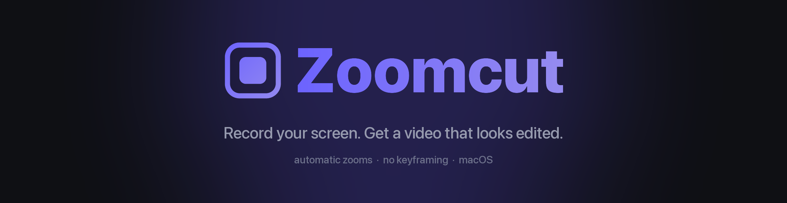
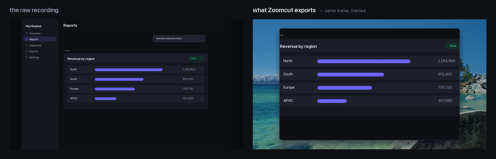
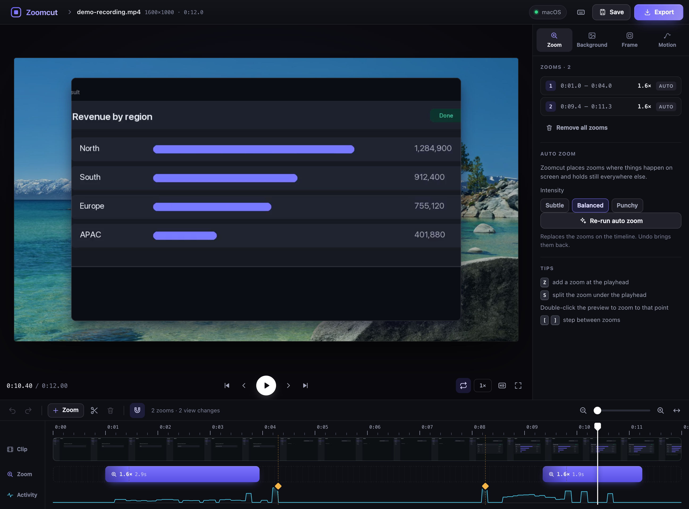

<div align="center">



Zoomcut watches what you actually did — typed into a box, opened a panel, got a result back —
and moves a virtual camera to match. Your recording floats on your desktop wallpaper with a soft
shadow, the camera pushes in where it matters and **holds perfectly still where it doesn't**.

**You never place a keyframe.**

[](https://github.com/ahmedawachi/zoomcut/actions/workflows/tests.yml)
[](https://github.com/ahmedawachi/zoomcut/releases/latest)
[](#requirements)
[](#requirements)
[](LICENSE)

</div>

---

<div align="center">



</div>

---

```bash
zoomcut            # opens the app in your browser
```

Pick a window. Hit record. Hit stop. That's the whole workflow.

<div align="center">

</div>

Zoomcut is an open-source **screen recorder with automatic zoom** for **macOS, Windows and
Linux** — a local app for making product demos, tutorials and bug reports that look edited,
without opening a video editor.

- **Records a window, a display or a region** — native capture on each platform
- **Finds the moments worth zooming into** and holds still the rest of the time
- **Puts your recording on your desktop wallpaper** with rounded corners and a soft shadow
- **Spring-driven camera moves** that settle like physics, not like a tween
- **A real editor when you want one** — a live preview that plays the camera moves exactly as
  they will export, zooms you drag, stretch and reframe on a timeline, undo for everything
- **Or no editor at all** — the project is plain JSON, and the command line does it all
- **Exports 1080p / 1440p / 4K** h.264, ready to drop into a PR or a release note
- **Runs entirely on your machine** — no account, no upload, no telemetry

## Contents

- [Why](#why)
- [Requirements](#requirements)
- [Install](#install)
- [The app](#the-app)
- [The command line](#the-command-line)
- [How the camera decides](#how-the-camera-decides)
- [Platform notes](#platform-notes)
- [Project files](#project-files)
- [Tests](#tests)
- [Troubleshooting](#troubleshooting)
- [How it's built](#how-its-built)
- [License](#license)

## Why

A raw screen recording is hard to watch. The interesting thing is usually 4% of a 4K frame, and
the viewer has no idea where to look. The usual fix is to open an editor and hand-place zooms,
which is slow and easy to overdo — most auto-zoom tools chase the cursor and never stop moving.

Zoomcut takes the opposite position: **stillness is the default and motion has to be earned.**
It finds the handful of moments that deserve a camera move, makes those moves, and otherwise
leaves the frame alone.

## Requirements

Python is only needed if you install from pip or source — the downloadable app bundles it.
Everything else is one package:

|  | |
|---|---|
| **OS** | macOS 13+, Windows 10+, or Linux with X11 |
| **ffmpeg** | required, see step 1 below |
| **Python** | 3.10+ with `numpy` and `Pillow` — *not needed for the download* |

Nothing runs in the background, there is no account, and nothing is uploaded: the app binds to
`127.0.0.1` and only serves files it produced itself.

## Install

Three steps.

### 1 · Install ffmpeg

Zoomcut uses ffmpeg to read and write video. One line for your platform:

| platform | command |
|---|---|
| **macOS** | `brew install ffmpeg` |
| **Windows** | `winget install Gyan.FFmpeg` |
| **Debian / Ubuntu** | `sudo apt install ffmpeg` |
| **Fedora** | `sudo dnf install ffmpeg` |
| **Arch** | `sudo pacman -S ffmpeg` |

Already have it somewhere unusual? Point Zoomcut at it: `ZOOMCUT_FFMPEG=/path/to/ffmpeg`.

### 2 · Get Zoomcut — pick one

<table>
<tr><th width="33%">A · Download the app</th><th width="33%">B · pip</th><th width="33%">C · From source</th></tr>
<tr valign="top">
<td>

*Easiest. No Python.*

Grab your build from
[**Releases**](https://github.com/ahmedawachi/zoomcut/releases/latest),
unpack it, and run the `zoomcut`
binary inside.

Available for Apple Silicon macOS,
Windows x86_64 and Linux x86_64.

</td><td>

```bash
pip install zoomcut
```

Works everywhere, including
Intel Macs.

</td><td>

```bash
git clone https://github.com/\
ahmedawachi/zoomcut.git
cd zoomcut
pip install numpy pillow
./zoomcut-cli
```

</td></tr></table>

> **macOS, first run:** the download is not signed by Apple, so right-click the `zoomcut`
> binary → **Open** the first time, instead of double-clicking it.

### 3 · Check it, then run it

```bash
zoomcut doctor     # confirms ffmpeg, capture, window picking and where files will go
zoomcut            # opens the app at http://127.0.0.1:8765
```

`doctor` prints a line per requirement and tells you exactly what to install if something is
missing:

```
Zoomcut 1.1.1 on macOS

  OK    ffmpeg  —  /opt/homebrew/bin/ffmpeg
  OK    ffprobe  —  /opt/homebrew/bin/ffprobe
  OK    screen recording (screencapture)
  OK    window picking  —  10 window(s) you could record
  OK    backgrounds  —  19 wallpaper(s)
  OK    output folder  —  /Users/you/Movies/Zoomcut

Everything Zoomcut needs is here. Run `zoomcut` to start.
```

### One-time extras

**macOS — allow screen recording.** System Settings → Privacy & Security → **Screen & System
Audio Recording** → enable whatever runs Zoomcut (your terminal, or the Zoomcut app), then
**restart it**. `zoomcut doctor` and the app's status dot both go green once it is granted.

**Linux — window picking.** Listing windows needs one small helper:
`sudo apt install wmctrl` (or `xdotool`). Without it, record a region or the whole display
instead. Zoomcut captures through **X11**; on a Wayland session log in with Xorg — it will tell
you rather than hand you a black video.

**Windows — nothing extra.**

## The app

```bash
zoomcut              # same as: zoomcut ui
```

Opens `http://127.0.0.1:8765`.

**Start** by recording — pick a window from a searchable list, a display or a region; a
three-second countdown gives you time to switch to it — or drop a recording you already have
anywhere on the page. Your recent recordings, projects and exports are one click away.

**Then edit**, or don't — Zoomcut has already placed the zooms by the time the editor opens.

| | |
|---|---|
| **Preview** | Plays the recording with the camera moving exactly as the export will — the same spring, the same framing, composited live in the browser. <kbd>F</kbd> swaps in a frame rendered by the real compositor, to check. |
| **Timeline** | A filmstrip, the zoom track and an activity trace, with view changes marked. Hover the zoom track and click to add a zoom; drag a zoom to move it, drag its edges to stretch it, <kbd>S</kbd> splits it. Drag the ends of the clip to trim. Everything snaps, and pinch or <kbd>⌘</kbd>-scroll zooms the timeline. |
| **Framing** | Select a zoom and drag the preview itself to reframe it, scroll over it to zoom further, or drag the box over the whole frame in the inspector. Double-click the preview to zoom to that point. |
| **Look** | Your own desktop pictures, a gradient, a colour or any image; padding, roundness and shadow; 16:9, 4:3, 1:1 or 9:16. |
| **Motion** | Snappy, balanced, smooth or lazy camera springs, with the curve they follow. |
| **Auto zoom** | Re-run the director as subtle, balanced or punchy — it only replaces the zooms, and undo brings them back. |
| **Export** | 1080p, 1440p or 4K at 30 or 60 fps, with a quick 1280-wide draft; cancel any time, then play the result or show it in its folder. |

Every change can be undone (<kbd>⌘Z</kbd>), <kbd>?</kbd> lists the keyboard shortcuts, and the
last look you used is where the next recording starts.

Finished files go to `~/Movies/Zoomcut` (macOS), `%USERPROFILE%\Videos\Zoomcut` (Windows) or
`~/Videos/Zoomcut` (Linux).

## The command line

```bash
zoomcut doctor                                   # is everything installed?
zoomcut windows                                  # what you can record
zoomcut shoot --mode window --window 2375        # record → auto-cut → render
zoomcut auto demo.mov                            # existing recording → finished video
zoomcut auto demo.mov --preview                  # fast 720p draft
zoomcut analyze demo.mov -o demo.json            # just the plan, to edit by hand
zoomcut render demo.json -o out.mp4
zoomcut still demo.json 4.5 -o frame.png         # one composited frame
zoomcut wallpapers
```

<details>
<summary><b>All flags</b></summary>

**Look** — on `auto`, `shoot`, `analyze`

| flag | default | what it does |
|---|---|---|
| `--background` | your desktop wallpaper | wallpaper name, an image path, `gradient` or `color` |
| `--dim` | `0.12` | darken the background, `0`–`1` |
| `--blur` | `0` | soften the background, in pixels |
| `--padding` | `0.0702` | margin around the window, as a fraction of the short edge |
| `--size` | `1440p` | `1440p`, `1080p` or `4k` |
| `--fps` | `60` | output frame rate |
| `--style-preset` | – | an editor project `.json` to take the look from |
| `--preset-zooms` | off | also use that file's zoom ranges instead of the automatic ones |

**Camera** — how eager the auto-director is

| flag | default | what it does |
|---|---|---|
| `--max-zoom` | `1.60` | how tight a zoom may get |
| `--min-zoom` | `1.22` | below this, a move isn't worth making — it stays wide |
| `--context` | `1.20` | breathing room around the action |
| `--min-shot` | `1.00` | shots shorter than this get merged away |
| `--wide-hold` | `1.10` | seconds spent wide after a view change |

**Capture** — on `record` and `shoot`

| flag | what it does |
|---|---|
| `--mode` | `window`, `display`, `region`, or `interactive` (macOS only) |
| `--window` | window id from `zoomcut windows` |
| `--region` | `x,y,w,h` |
| `--display` | display number, `1` is main |
| `--seconds` | stop automatically after N seconds |
| `--no-cursor` / `--clicks` | hide the pointer / highlight clicks (clicks: macOS only) |

</details>

## How the camera decides

```
recording ──▶ decode small + grey at 20fps
                       │
                       ├─▶ per-frame difference ──▶ heat map of what changed
                       │                         └─▶ global spikes  = cuts
                       └─▶ gradient of the mean frame = where the interface is busy
                                                           │
                                     ┌─────────────────────┘
                                     ▼
                     plan shots ──▶ merge runts ──▶ spring ──▶ composite ──▶ h.264
```

1. **Cuts.** A whole-screen change — a view switching, a panel opening — becomes a structural beat.
2. **Shots.** Between cuts it frames the heat. Zoom comes from how spread out the action is;
   position is chosen to **capture the most activity** while keeping the crop's edges on *quiet*
   parts of the interface. That second term is what stops a crop slicing through a sidebar: when
   the action hugs an edge, the best-covering window is the one flush against it, which cuts
   nothing.
3. **Stillness.** One shot per stretch, held exactly. The camera does not creep while nothing is
   happening.
4. **Reveals.** It pulls back to the *whole, uncropped* window slightly **before** a cut lands, so
   a change is never revealed half-framed.
5. **Restraint.** Shots below `--min-shot` are merged, near-identical neighbours fuse, and zooms
   too timid to notice are dropped. It opens and closes on the full window.

Moves are integrated through a **damped spring** (ζ ≈ 0.80) rather than an easing curve, so they
settle like physics instead of like a tween.

The background is dithered before encoding and the encoder runs with `aq-mode=3`. A static
gradient or sky will otherwise band badly in 8-bit 4:2:0 — and because the background never
moves, that banding would sit on screen for the entire clip. Measured on a real export, this
takes flat-runs in the sky from **83px down to 2.4px**.

## Platform notes

Each is handled automatically; they're written down because they'll confuse you if you ever
script these tools yourself.

**macOS — recordings get silently truncated.**
`screencapture -v` writes variable frame rate and ends the file at the *last on-screen change*.
Record 10 seconds that finish on a still screen and the file honestly claims about 6. Zoomcut
measures wall-clock time and clones the final frame to match.

**macOS — it refuses to write dot-files, and still exits 0.**
`screencapture -x -t png /tmp/.probe.png` writes nothing and reports success. Output names
starting with `.` are rejected up front. Window capture also passes `-o`, so the window's own
drop shadow isn't baked in and Zoomcut's shadow is the only one in frame.

**Windows.** Capture is ffmpeg's `gdigrab`. A window is grabbed by title, which follows it as it
moves; if the title is empty or ffmpeg can't match it, Zoomcut falls back to the window's
rectangle automatically. The window list comes from `EnumWindows` with DWM's extended frame
bounds, so the invisible resize border isn't included.

**Linux.** Capture is ffmpeg's `x11grab`, so a window is recorded as its rectangle. Window
picking needs `wmctrl` or `xdotool` — without either, record a region or the whole display.
**Wayland is not supported**: X11 capture generally sees only XWayland clients, so log into an
Xorg session for now. Zoomcut says so explicitly instead of handing you a black video.

## Project files

`zoomcut analyze` writes plain, hand-editable JSON:

```jsonc
{
  "source": "/home/you/Videos/Zoomcut/capture.mkv",
  "trim": [0.0, null],
  "output": { "width": 2560, "height": 1440, "fps": 60, "crf": 17 },
  "style": {
    "background": { "type": "wallpaper", "name": "Tahoe Day", "dim": 0.12, "blur": 0 },
    "paddingRatio": 0.0702,
    "cornerRadius": 0.012,
    "shadow": { "distance": 0.0271, "blur": 0.0215, "alpha": 0.52 }
  },
  "camera": {
    "spring": { "mass": 2.25, "stiffness": 200, "damping": 36 },
    "shots": [ { "start": 0.0, "end": 1.0, "zoom": 1.0, "cx": 0.5, "cy": 0.5, "reason": "open" } ],
    "keys":  [ [0.0, 1.0, 0.5, 0.5], [1.0, 1.0, 0.5, 0.5] ]
  }
}
```

`shots` is the readable plan; `keys` is what the renderer consumes. Edit shots in the app and the
keys are rebuilt for you. `zoom: 1.0` always means the whole, uncropped window; `cx`/`cy` are
`0`–`1` across the recording.

## Tests

```bash
python3 tests/test_all.py             # everything (needs a desktop session)
python3 tests/test_all.py --quick     # skips wallpapers, window list, live recording
python3 tools/sim_platform.py linux   # run the suite as if this were Linux
```

**308 checks.** `sim_platform.py` flips the platform flags so the Windows and Linux
branches of our own logic can be exercised from any machine — it is how the "this machine has no
wallpapers installed" assumption was caught before it reached a server image. CI then runs the
suite for real on **macOS, Windows and Linux**, and on Linux and Windows it goes
further: it records for real (Linux under a virtual X display), auto-cuts that capture and
renders it, so the whole cycle is exercised on each platform every push.

What's covered: camera maths (spring convergence, crop clamping under hostile input); the
director's invariants on synthetic clips including a dead-still one and a strobing one — always
opens and closes on the full window, shots tile the timeline with no gaps, every crop stays
inside the frame; edge cases that would ruin a first run (0.6s clips, 160×120, portrait, missing
files, dot-file output, a window id that no longer exists); the Windows and Linux capture command
builders; style-preset import; wallpaper discovery; the renderer including trims and a banding
check; and every web endpoint, including confirming that `/etc/passwd` and `~/.ssh/id_rsa` are
*not* servable and that video is served with `Range` support so it can seek.

The editor is held to the same standard: its camera (`web/camera.js`) is run under Node and
compared with the renderer frame by frame, so the preview cannot drift from the export. The
local server refuses requests from other websites — a page you visit cannot start a recording or
read your files — uploads are checked and never overwrite anything, a failed or cancelled export
never costs you a file that was already there, and the preview's caches stay bounded.

Regenerate the documentation images with `python3 tools/make_docs.py` and the brand assets with
`python3 tools/make_brand.py`. The screenshots use a synthetic recording and a fixed window list
(`ZOOMCUT_DEMO=1`), so nobody's real screen ends up in the repository.

## Troubleshooting

Run `zoomcut doctor` first — it names anything missing and how to install it.

| Symptom | Fix |
|---|---|
| "Permission needed" (macOS) | Grant Screen Recording to whatever launched Zoomcut, then restart it |
| "no X11 display found" (Linux) | You're on Wayland — log in with an Xorg session |
| Window list is empty (Linux) | `sudo apt install wmctrl`, or record a region instead |
| `ffmpeg was not found` | Install it, or point Zoomcut at it with `ZOOMCUT_FFMPEG=/path/to/ffmpeg` |
| The camera zooms somewhere odd | Something else on screen was moving — a clock, a notification. Select that zoom on the timeline and drag the preview to reframe it, or delete it; on the command line, raise `--min-shot` |
| Too much zooming | Lower `--max-zoom`, or raise `--min-zoom` so marginal moves stay wide |
| Zooms feel too tight | Raise `--context` |
| Nothing zooms at all | The whole screen was changing at once, so every beat is a cut. Lower `--wide-hold` |
| Background bands after sharing | A platform re-compressed it. Export `--size 1080p` |

## How it's built

Pure Python, no framework. `numpy` and `Pillow` do the compositing, `ffmpeg` does codecs, and the
window list comes from each platform's own API through `ctypes` — so it runs on a stock Python
with no `pyobjc` or `pywin32`.

| module | what it does |
|---|---|
| `analyze.py` | decodes once, small and grey; builds the heat map, cuts and structure profiles |
| `director.py` | turns that into a shot plan, then into camera keyframes |
| `render.py` | background, shadow, rounded window, spring camera, encode |
| `recorder.py` | one capture backend per platform, with their quirks handled |
| `winlist.py` | window enumeration: CoreGraphics, EnumWindows, wmctrl/xdotool |
| `wallpapers.py` | finds and caches the wallpapers installed on your machine |
| `project.py` | the project file, and style-preset import |
| `media.py` | the editor's preview proxy, filmstrip and recents posters, in a bounded cache |
| `server.py` + `web/` | the local app: a stdlib server and a dependency-free editor |

Releases are built by [`release.yml`](.github/workflows/release.yml): PyInstaller folder builds
for macOS (arm64 and x86_64), Windows and Linux, plus a wheel and sdist. Folder builds, not
one-file — a one-file bundle re-links every extension module on each launch, which costs about
ten seconds before the app answers. The folder build starts in **0.3 s**.

## License

[MIT](LICENSE) © Ahmed Awachi
